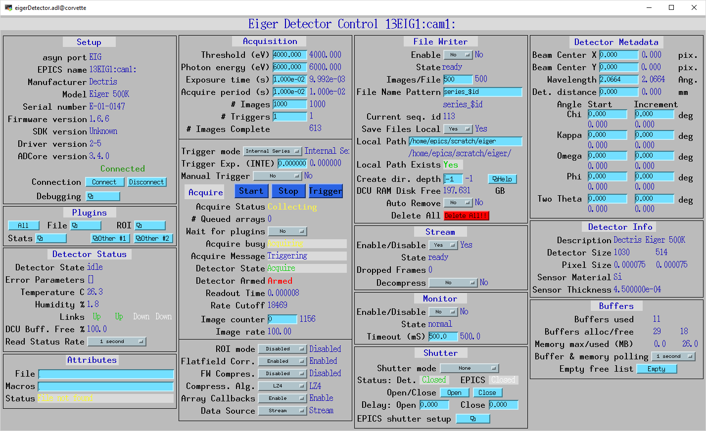

=======
ADEiger
=======

:author: Bruno Martins, Diego Omitto, Mark Rivers

.. _eigerDetector: https://areadetector.github.io/master/areaDetectorDoxygenHTML/eiger_detector_8cpp.html
.. _eigerDetector class: https://areadetector.github.io/master/areaDetectorDoxygenHTML/classeiger_detector.html
.. _ADDriver: https://areadetector.github.io/master/ADCore/ADDriver.html
.. _Dectris: http://www.dectris.com
.. _areaDetector: https://areadetector.github.io/master/index.html
.. _EPICS: http://www.aps.anl.gov/epics
.. _asynNDArrayDriver: https://areadetector.github.io/master/ADCore/NDArray.html#asynndarraydriver

.. contents:: Contents

Introduction
------------

This is an `EPICS`_ `areaDetector`_ driver for the Eiger detector
from `Dectris`_. It has been tested on the Eiger 500K, 1M, 4M and 16M
with the firmware version 1.6.4+. The driver communicates with the
detector via its SIMPLON REST interface, so no library from Dectris is
required. The images can pulled from the detector as HDF5 files, as a
ZeroMQ stream or both. The files can be both saved to disk and passed
to the areaDetector pipeline at the same time.

All trigger modes are supported, although Internal Enable mode seems
to not be working properly. See Known Issues.

This driver inherits from `ADDriver`_. It implements many of the
parameters in `asynNDArrayDriver`_ and in `ADDriver`_. It
also implements a number of parameters that are specific to the Eiger
detector. The `eigerDetector class`_ describes this
class in detail.

This document does not attempt to explain the meaning of the Eiger-
specific parameters, as they are explained in the SIMPLON API
Reference and in the EIGER Detector Manual documents from Dectris.
Sometimes it does, however, refer to those parameters as they are
named in Dectris' documentation.

The SIMPLON API provides ways to query parameter limits, valid values
for enums, error conditions, etc. The driver will clamp values to
their minumum or maximum value if they are outside the acceptable
range. Setting a parameter will immediately push its value to the
detector.

This driver was built upon a multithreaded architecture. A combination
of threads is used to simultaneously pull files from the detector,
save them to disk and parse them into NDArrays. A dedicated thread is
used to receive images in a ZeroMQ stream.

A few Eiger parameters are set at IOC initialization time and are
expected to not change. Namely:

* detector/config/auto_summation = true
* filewriter/config/image_nr_start = 1
* monitor/config/buffer_size = 1

Accessing New Parameters
------------------------

Some parameters are not relevant to the driver operation and as such
are not exposed initially by the driver as PVs. However, there is a
mechanism to access other parameters not created automatically by the
driver by simply instantiating new records with the appropriate
`drvInfo` string. Some of the PVs are created this way. For example,
the PV XPixelSize_RBV has the following `drvInfo`::

    EIG_DCD_x_pixel_size

For those parameters, the first four characters must be `EIG_`. Then
the fifth character must be one of:

* `D`: Detector subsystem
* `M`: Monitor subsystem
* `F`: FileWriter subsystem
* `S`: Stream subsystem

The sixth character determines if the parameter is a configuration or
a status parameter:

* `C`: Configuration
* `S`: Status

The seventh character determines which asyn parameter type to use:

* `I`: Integer (`asynParamInt32`)
* `D`: Double (`asynParamFloat64`)
* `S`: String (`asynParamOctet`)

The eighth character must be a '_', and the remaining characters are
the parameter's name according to the SIMPLON API Manual. Hence, for
this example, this PV will be accessing the parameter::

    detector/api/<version>/config/x_pixel_size

Trigger Modes
-------------

There are four trigger modes available:

* **Internal Series**: one internal trigger pulse generates N images
* **Internal Enable**: one internal trigger pulse generates one image
* **External Series**: one external trigger pulse generates N images
* **External Enable**: one external trigger pulse generates one image

The total number of images generated by **Internal** and **External
Series** modes is given by the product of the NumImages and
NumTriggers PVs (nimages and ntriggers in Dectris terminology).

On both **Internal** and **External Enable** modes the total number of
images generated is given solely by the NumTriggers PV (ntriggers).
NumImages is set to 1 temporarily during the acquisition.

Triggers for **Internal Enable** mode are sent by processing the
Trigger PV. The exposure for each individual image is given by the
TriggerExposure PV and can change between triggers in the same
acquisition. This mode is experimental as of firmware 1.5.0. See Known
Issues.

Manual Trigger
--------------

On **Internal Series** and **Internal Enable** modes, if the
ManualTrigger PV is set to **Yes**, the triggers are not auto generated by
the driver. Instead, they are sent by processing the Trigger PV. On
**Internal Enable** mode the trigger carries an exposure value that
can change for each trigger, which is set by the TriggerExposure PV.
Note that the **Internal Enable** mode is experimental as of firmware
1.5.0, see Known Issues.

Data Acquisition
----------------

Data generated by the Eiger can be pulled from the detector in a
number of ways. The detector has three modules (in Dectris'
terminology) that make the results of the acquisition available in
different ways. The **FileWriter** module writes the generated images
to the detector disk as HDF5 files that consist of a master (header)
file and a number of data files. The **Stream** module makes the
images available as soon as they are captured as a ZeroMQ stream. The
**Monitor** module produces TIFF images every so often to monitor how
a long acquisition is progressing.

Data from the FileWriter or from the Stream mode can be parsed into
NDArrays for the areaDetector pipeline. The actual source is selected
with the DataSource PV. If DataSource is set to None, however, no data
will be sent to the areaDetector pipeline but the detector will still
be controllable via the areaDetector driver; third-party clients can
then pull files or listen to the ZeroMQ stream independently of this
driver.

Using FileWriter
~~~~~~~~~~~~~~~~

The FileWriter module is activated when FWEnable is set to Yes. Files
generated by the FileWriter have names according to the FWNamePattern
PV. The default pattern is "series_$id", where $id is replaced by the
Sequence ID of the acquisition. A master file is generated as soon as
the detector is successfully armed. A number of data files follow. The
number of data files generated depends on the total number of images
of the acquisition and the FWNFilesPerImage PV.

For example, if TriggerMode is **External Enable**, NumImages is 60,
NumTriggers is 2, FWNImagesPerFile is 100, Sequence ID for the
acquisition is 1 and FWNamePattern is "series_$id", a total of three
files will be generated:

* series_1_master.h5
* series_1_data_000001.h5 (with 100 images)
* series_1_data_000002.h5 (with 20 images)

The generated files will be downloaded either if DataSource is set to
FileWriter or if SaveFiles is set to Yes. Files are downloaded as soon
as they are available. To determine if a file is available the driver
polls the detector at a nominal rate of 10Hz. While a file is being
processed the next file available is downloaded in parallel. All files
will remain on the detector disk unless FWAutoRemove is set to Yes.

When saving files to disk (SaveFiles = Yes) it is possible to set the
file's owner, its group and its access permissions with FileOwner,
FileOwnerGrp and FilePerms PVs. To be able to set arbitrary owners the
IOC executable requires CAP_SETUID and CAP_SETGID capabilities, which
can be given with the command::

    sudo setcap cap_setuid,cap_setgid+ep eigerDetectorApp

All files on the detector disk can be deleted at once by processing
the FWClear PV.

If the last data file of a series won't be full (e.g.
series_1_data_000002.h5 with 20 images) then it will only appear on
the detector disk after a disarm command (issued when the acquisition
is stopped), which flushes the FileWriter buffer.

Using Stream
~~~~~~~~~~~~

The Stream module is activated when StreamEnable is set to Yes. Data
will then be available on the detector's tcp port 9999 as a ZMQ_PUSH
socket. If DataSource is set to Stream, this driver opens a
corresponding ZMQ_PULL socket and parses the incoming data as
NDArrays. Otherwise a third-party client can listen on that socket for
data. The format of the packets is specified in the Eiger SIMPLON API
documentation.

Using Monitor
~~~~~~~~~~~~~

The Monitor module is activated when MonitorEnable is set to Yes. Data
will be available whenever the monitor module buffer is full (has one
image available). This driver waits MonitorTimeout ms for data to be
available. There is a rate-limit of 10Hz. Once downloaded, the TIFF
image is parsed into areaDetector's NDArray on NDArrayAddr 1
(therefore, an independent NDArray stream).

Chrystallography Parameters
---------------------------

A few parameters are available as metadata for the acquisition. These
values are stored on the master file and sent as metadata in ZeroMQ
stream, but otherwise don't affect the acquisition, with the exception
of the Wavelength parameter, which sets Photon Energy accordingly.

Implementation of standard driver parameters
--------------------------------------------

The following table describes how the Eiger driver implements some of
the standard driver parameters.

.. cssclass:: table-bordered table-striped table-hover
.. flat-table::
  :header-rows: 2

  * -
    - **Implementation of Parameters in asynNDArrayDriver.h and ADDriver.h, and EPICS Record Definitions in ADBase.template and NDFile.template**
    -
    -
  * - **Parameter index variable**
    - **EPICS record name**
    - **Eiger Parameter**
    - **Description**
  * - ADTriggerMode
    - $(P)$(R)TriggerMode, $(P)$(R)TriggerMode_RBV
    - detector/config/trigger_mode
    - Sets the trigger mode for the detector. Options are:
        * Internal Series
        * Internal Enable
        * External Series
        * External Enable
  * - ADNumImages
    - $(P)$(R)NumImages, $(P)$(R)NumImages_RBV
    - detector/config/nimages
    - Sets the number of images to take per trigger when on Internal Series or External
      Series mode.
  * - ADAcquireTime
    - $(P)$(R)AcquireTime, $(P)$(R)AcquireTime_RBV
    - detector/config/count_time
    - Sets the parameter "count_time", which is the exposure time for a single image on
      INTS or EXTS mode.
  * - ADAcquirePeriod
    - $(P)$(R)AcquirePeriod, $(P)$(R)AcquirePeriod_RBV
    - detector/config/frame_time
    - Sets the parameter "frame_time", which directly affects the frame rate of the detector.
      The resulting frame rate will be 1/AcquirePeriod.
  * - NDDataType
    - $(P)$(R)DataType_RBV
    -
    - The data type of the image data. If AcquireTime results in less than 50Hz, this
      will have the value UInt16, otherwise UInt32.
  * - ADTemperatureActual
    - $(P)$(R)TemperatureActual
    - detector/status/board_000/th0_temp
    - Reads the actual temperature of the detector.
  * - ADMaxSizeX
    - $(P)$(R)MaxSizeX_RBV
    -
    - Detector sensor size in the X direction.
  * - ADMaxSizeY
    - $(P)$(R)MaxSizeY_RBV
    -
    - Detector sensor size in the Y direction.
  * - NDArraySizeX
    - $(P)$(R)ArraySizeX_RBV
    - detector/config/x_pixels_in_detector
    - Current detector sensor size in the X direction. This can change depending on the
      ROI Mode selected.
  * - NDArraySizeY
    - $(P)$(R)ArraySizeY_RBV
    - detector/config/y_pixels_in_detector
    - Current detector sensor size in the Y direction. This can change depending on the
      ROI Mode selected.
  * - ADManufacturer, ADModel
    - $(P)$(R)Manufacturer_RBV, $(P)$(R)Model_RBV
    - detector/config/description
    - Reads the detector manufacturer (Dectris) and model (Eiger xx M).
  * - ADSerialNumber
    - $(P)$(R)SerialNumber_RBV
    - detector/config/detector_number
    - Detector serial number
  * - ADFirmwareVersion
    - $(P)$(R)FirmwareVersion_RBV
    - detector/config/software_version
    - Detector firmware version
  * - NDDriverVersion
    - $(P)$(R)DriverVersion_RBV
    -
    - This driver's version

Eiger specific parameters
-------------------------

The Eiger driver implements the following parameters in addition to
those in asynNDArrayDriver.h and ADDriver.h.

.. cssclass:: table-bordered table-striped table-hover
.. flat-table::
  :header-rows: 2

  * -
    - **Parameter Definitions in eigerDetector.cpp and EPICS Record Definitions in eiger.template**
  * - **Parameter index variable**
    - **Eiger Parameter**
    - **asyn interface**
    - **Access**
    - **Description**
    - **drvInfo string**
    - **EPICS record name**
    - **EPICS record type**
  * - **Detector Metadata**
  * - EigerDescription
    - detector/config/description
    - asynOctet
    - R/O
    - Detector's manufacturer and model
    - DESCRIPTION
    - Description_RBV
    - stringin
  * - EigerSensorMaterial
    - detector/config/sensor_material
    - asynOctet
    - R/O
    - Detector's sensor material
    - EIG_DCD_sensor_material
    - SensorMaterial_RBV
    - stringin
  * - EigerSensorThickness
    - detector/config/sensor_thickness
    - asynFloat64
    - R/O
    - Detector's sensor thickness, in meters
    - EIG_DCD_sensor_thickness
    - SensorThickness_RBV
    - ai
  * - EigerXPixelSize
    - detector/config/x_pixel_size
    - asynFloat64
    - R/O
    - Detector's pixel size in the X direction, in meters
    - EIG_DCD_x_pixel_size
    - XPixelSize_RBV
    - ai
  * - EigerYPixelSize
    - detector/config/y_pixel_size
    - asynFloat64
    - R/O
    - Detector's pixel size in the Y direction, in meters
    - EIG_DCD_y_pixel_size
    - YPixelSize_RBV
    - ai
  * - EigerDeadTime
    - detector/config/detector_readout_time
    - asynFloat64
    - R/O
    - Detector's readout time (dead time) between frames. Changes with different Threshold
      Energies.
    - EIG_DCD_detector_readout_time
    - DeadTime_RBV
    - ai
  * - **Status Parameters**
  * - EigerState
    - detector/status/state
    - asynOctet
    - R/O
    - State of the detector
    - STATE
    - State_RBV
    - stringin
  * - EigerError
    - detector/status/error
    - asynOctet
    - R/O
    - List of parameters causing an error state
    - ERROR
    - Error_RBV
    - stringin
  * - EigerDCUBufferFree
    - detector/status/builder/dcu_buffer_free
    - asynFloat64
    - R/O
    - Percentage of the detector's internal buffer that is free. Low values may indicate
      a problem.
    - DCU_BUF_FREE
    - DCUBufferFree_RBV
    - ai
  * - EigerThTemp0
    - detector/status/board_000/th0_temp
    - asynFloat64
    - R/O
    - Temperature of the first module
    - TH_TEMP_0
    - Temp0_RBV
    - ai
  * - EigerThHumid0
    - detector/status/board_000/th0_humidity
    - asynFloat64
    - R/O
    - Humidity of the first module
    - TH_HUMID_0
    - Humid0_RBV
    - ai
  * - EigerLink0, EigerLink1, EigerLink2, EigerLink3
    - detector/status/link_0, detector/status/link_1, detector/status/link_2, detector/status/link_3
    - asynInt32
    - R/O
    - Status of the four links between the detector server and the head
    - LINK_0, LINK_1, LINK_2, LINK_3
    - Link0_RBV, Link1_RBV, Link2_RBV, Link3_RBV
    - bi
  * - **FileWriter Control**
  * - EigerFWEnable
    - filewriter/config/mode
    - asynInt32
    - R/W
    - Enables or disables the FileWriter module
    - FW_ENABLE
    - FWEnable, FWEnable_RBV
    - bo, bi
  * - EigerFWClear
    - filewriter/config/clear
    - asynInt32
    - W/O
    - Writing to this PV clears *all* files on the detector server disk
    - CLEAR
    - FWClear
    - ao
  * - EigerFWCompression
    - filewriter/config/compression_enabled
    - asynInt32
    - R/W
    - Enables or disables LZ4 or BSLZ4 compression on the server side
    - COMPRESSION
    - FWCompression, FWCompression_RBV
    - bo, bi
  * - EigerFWNamePattern
    - filewriter/config/name_patttern
    - asynOctet
    - R/W
    - Name pattern for the generated HDF5 files. The pattern can be anything, but it must
      contain the string '$id' in it. This string is replaced with the current sequence
      id of the acquisition. The default is: "series_$id", which would generate the files:
        * series_1_master.h5
        * series_1_data_000001.h5
        * series_1_data_000002.h5
        * ...
      For the sequence id 1. If '$id' is omitted, files might get overwritten on the server,
      because then every acqusition would generate files with the same name
    - NAME_PATTERN
    - FWNamePattern, FWNamePattern_RBV
    - stringout, stringin
  * - EigerFWNImagesPerFile
    - filewriter/config/nimages_per_file
    - asynInt32
    - R/W
    - Number of images per HDF5 data file
    - NIMAGES_PER_FILE
    - FWNImgsPerFile, FWNImgsPerFile_RBV
    - ao, ai
  * - EigerFWAutoRemove
    -
    - asynInt32
    - R/W
    - Controls whether downloaded files should be removed from the detector disk
    - AUTO_REMOVE
    - FWAutoRemove, FWAutoRemove_RBV
    - bo, bi
  * - EigerFWFree
    - filewriter/status/buffer_free
    - asynFloat64
    - R/O
    - Free space on detector disk.
    - FW_FREE
    - FWFree_RBV
    - ai
  * - EigerFWState
    - filewriter/status/state
    - asynOctet
    - R/O
    - State of the FileWriter module
    - FW_STATE
    - FWState_RBV
    - stringin
  * - **Stream Control**
  * - EigerStreamEnable
    - stream/config/mode
    - asynInt32
    - R/W
    - Enables or disables the Stream module
    - STREAM_ENABLE
    - StreamEnable, StreamEnable_RBV
    - bo, bi
  * - EigerStreamDropped
    - stream/status/dropped
    - asynInt32
    - R/O
    - Indicates how many images were dropped in the last acquisition
    - STREAM_DROPPED
    - StreamDropped_RBV
    - ai
  * - EigerStreamDecompress
    - N.A.
    - asynInt32
    - R/W
    - Controls whether the NDArrays from the Stream interface are decompressed (Yes) or
      compressed (No)
    - STREAM_DECOMPRES
    - StreamDecompress, StreamDecompress_RBV
    - bo, bi
  * - EigerStreamState
    - stream/status/state
    - asynOctet
    - R/O
    - State of the Stream module
    - STREAM_STATE
    - StreamState_RBV
    - stringin
  * -
    - stream/config/header_detail
    - asynInt32
    - R/W
    - Selects the level of detail for Stream API Headers. Options are:
        * All
        * Basic
        * None
    - EIG_SCI_header_detail
    - StreamHdrDetail, StreamHdrDetail_RBV
    - mbbo, mbbi
  * -
    - stream/config/header_appendix
    - asynOctet
    - R/W
    - Sets the text to be appended to the Stream API headers
    - EIG_SCS_header_appendix
    - StreamHdrAppendix
    - waveform
  * -
    - stream/config/image_appendix
    - asynOctet
    - R/W
    - Sets the text to be appended to the Stream API images
    - EIG_SCS_image_appendix
    - StreamImgAppendix
    - waveform
  * - **Monitor Control**
  * - EigerMonitorEnable
    - monitor/config/mode
    - asynInt32
    - R/W
    - Enables or disables the Monitor module
    - MONITOR_ENABLE
    - MonitorEnable, MonitorEnable_RBV
    - bo, bi
  * - EigerMonitorTimeout
    -
    - asynInt32
    - R/W
    - Timeout for queries on the Monitor interface for new images
    - MONITOR_TIMEOUT
    - MonitorTimeout, MonitorTimeout_RBV
    - ao, ai
  * - EigerMonitorState
    - monitor/status/state
    - asynOctet
    - R/O
    - State of the Monitor module
    - MONITOR_STATE
    - MonitorState_RBV
    - stringin
  * - **Acquisition Metadata**
  * - EigerBeamX
    - detector/config/beam_center_x
    - asynFloat64
    - R/W
    - X position of the beam
    - EIG_DCD_beam_center_x
    - BeamX, BeamX_RBV
    - ao, ai
  * - EigerBeamY
    - detector/config/beam_center_y
    - asynFloat64
    - R/W
    - Y position of the beam
    - EIG_DCD_beam_center_y
    - BeamY, BeamY_RBV
    - ao, ai
  * - EigerDetDist
    - detector/config/detector_distance
    - asynFloat64
    - R/W
    - Detector distance
    - EIG_DCD_detector_distance
    - DetDist, DetDist_RBV
    - ao, ai
  * - EigerWavelength
    - detector/config/wavelength
    - asynFloat64
    - R/W
    - Wavelength of the beam. This parameter is automatically changed whenever the PhotonEnergy
      changes
    - WAVELENGTH
    - Wavelength, Wavelength_RBV
    - ao, ai
  * - EigerCountCutoff
    - detector/config/countrate_correction_count_cutoff
    - asynInt32
    - R/O
    - Number of counts after which the detector will cutoff due to the count rate correction.
    - EIG_DCI_countrate_correction_count_cutoff
    - CountCutoff_RBV
    - ai
  * - **Acquisition MX Metadata**
  * - EigerChiStart
    - detector/config/chi_start
    - asynFloat64
    - R/W
    - Start value of the Chi angle
    - EIG_DCD_chi_start
    - ChiStart, ChiStart_RBV
    - ao, ai
  * - EigerChiIncr
    - detector/config/chi_increment
    - asynFloat64
    - R/W
    - Chi angle increment per frame
    - EIG_DCD_chi_increment
    - ChiIncr, ChiIncr_RBV
    - ao, ai
  * - EigerKappaStart
    - detector/config/kappa_start
    - asynFloat64
    - R/W
    - Start value of the Kappa angle
    - EIG_DCD_kappa_start
    - KappaStart, KappaStart_RBV
    - ao, ai
  * - EigerKappaIncr
    - detector/config/kappa_increment
    - asynFloat64
    - R/W
    - Kappa angle increment per frame
    - EIG_DCD_kappa_increment
    - KappaIncr, KappaIncr_RBV
    - ao, ai
  * - EigerOmegaStart
    - detector/config/omega_start
    - asynFloat64
    - R/W
    - Start value of the Omega angle
    - EIG_DCD_omega_start
    - OmegaStart, OmegaStart_RBV
    - ao, ai
  * - EigerOmegaIncr
    - detector/config/omega_increment
    - asynFloat64
    - R/W
    - Omega angle increment per frame
    - EIG_DCD_omega_increment
    - OmegaIncr, OmegaIncr_RBV
    - ao, ai
  * - EigerPhiStart
    - detector/config/phi_start
    - asynFloat64
    - R/W
    - Start value of the Phi angle
    - EIG_DCD_phi_start
    - PhiStart, PhiStart_RBV
    - ao, ai
  * - EigerPhiIncr
    - detector/config/phi_increment
    - asynFloat64
    - R/W
    - Phi angle increment per frame
    - EIG_DCD_phi_increment
    - PhiIncr, PhiIncr_RBV
    - ao, ai
  * - EigerTwoThetaStart
    - detector/config/two_theta_start
    - asynFloat64
    - R/W
    - Start value of the TwoTheta angle
    - EIG_DCD_two_theta_start
    - TwoThetaStart, TwoThetaStart_RBV
    - ao, ai
  * - EigerTwoThetaIncr
    - detector/config/two_theta_increment
    - asynFloat64
    - R/W
    - TwoTheta angle increment per frame
    - EIG_DCD_two_theta_increment
    - TwoThetaIncr, TwoThetaIncr_RBV
    - ao, ai
  * - **Acquisition Control**
  * - EigerDataSource
    -
    - asynInt32
    - R/W
    - Which data source to use for areaDetecor pipeline. Valid values:
        * None
        * FileWriter
        * Stream
    - DATA_SOURCE
    - DataSource, DataSource_RBV
    - mbbo, mbbi
  * - EigerArmed
    -
    - asynInt32
    - R/O
    - Armed state of the detector
    - ARMED
    - Armed
    - bi
  * - EigerSaveFiles
    -
    - asynInt32
    - R/W
    - Controls whether acquired files should be saved locally to disk
    - SAVE_FILES
    - SaveFiles, SaveFiles_RBV
    - bo, bi
  * - EigerFileOwner
    -
    - asynOctet
    - R/W
    - Controls the owner of the file saved to disk. Requires the IOC to have the CAP_SETUID
      capability.
    - FILE_OWNER
    - FileOwner, FileOwner_RBV
    - stringout, stringin
  * - EigerFileOwnerGroup
    -
    - asynOctet
    - R/W
    - Controls the owner group of the file saved to disk. Requires the IOC to have the
      CAP_SETGID capability.
    - FILE_OWNER_GROUP
    - FileOwnerGrp, FileOwnerGrp_RBV
    - stringout, stringin
  * - EigerFilePerms
    -
    - asynInt32
    - R/W
    - Controls the permissions for the files saved to disk
    - FILE_PERMISSIONS
    - FilePerms
    - ao
  * - EigerSequenceId
    -
    - asynInt32
    - R/O
    - Sequence ID of the current acquisition
    - SEQ_ID
    - SequenceId
    - ai
  * - EigerFlatfield
    - detector/config/flatfield_correction_applied
    - asynInt32
    - R/W
    - Controls whether the flatfield correction should be applied
    - EIG_DCI_flatfield_correction_applied
    - FlatfieldApplied, FlatfieldApplied_RBV
    - bo, bi
  * - EigerPhotonEnergy
    - detector/config/photon_energy
    - asynFloat64
    - R/W
    - Photon energy for the acquisition
    - PHOTON_ENERGY
    - PhotonEnergy, PhotonEnergy_RBV
    - ao, ai
  * - EigerThreshold
    - detector/config/threshold_energy
    - asynFloat64
    - R/W
    - Energy threshold for the acquisition
    - THRESHOLD
    - Threshold, Threshold_RBV
    - ao, ai
  * - EigerTrigger
    - detector/command/trigger
    - asynInt32
    - W/O
    - Software trigger to be used on modes INTS and INTE when ManualTrigger is set
    - TRIGGER
    - Trigger
    - ao
  * - EigerTriggerExp
    - detector/command/trigger
    - asynFloat64
    - R/W
    - Exposure to be used with the triggers on the INTE mode
    - TRIGGER_EXPOSURE
    - TriggerExposure, TriggerExposure_RBV
    - ao, ai
  * - EigerNTriggers
    - detector/config/ntrigger
    - asynInt32
    - R/W
    - Number of triggers for the acquisition
    - NUM_TRIGGERS
    - NumTriggers, NumTriggers_RBV
    - ao, ai
  * - EigerManualTrigger
    -
    - asynInt32
    - R/W
    - On INTS and INTE modes, controls whether triggers will be issued automatically (0)
      or only via the Trigger PV (1).
    - MANUAL_TRIGGER
    - ManualTrigger, ManualTrigger_RBV
    - bo, bi
  * - EigerCompressionAlgo
    - detector/config/compression
    - asynInt32
    - R/W
    - Compression algorithm to use when compression is enabled. Options are:
        * lz4
        * bslz4 (bitshuffle lz4)
      The selected algorithm will always be used on the Stream ZMQ interface. It will
      also be used for HDF5 files written by the FileWriter interface if FWCompression=Enabled.
    - COMPRESSION_ALGO
    - CompressionAlgo, CompressionAlgo_RBV
    - mbbo, mbbi
  * - EigerROIMode
    - detector/config/roi_mode
    - asynInt32
    - R/W
    - Which ROI mode to use. **Only supported on Eiger 9M and 16M.** Options are:
        * Disabled
        * 4M
    - ROI_MODE
    - ROIMode, ROIMode_RBV
    - mbbo, mbbi

Unsupported standard driver parameters
--------------------------------------

All standard parameters not mentioned in this document are not
supported.

Configuration
-------------

The Eiger driver is created with the eigerDetectorConfig command,
either from C/C++ or from the EPICS IOC shell.::

    int eigerDetectorConfig(const char *portName, const char *hostname,
                            int maxBuffers, size_t maxMemory, int priority, int stackSize)

For details on the meaning of the parameters to this function refer to
the detailed documentation on the eigerDetectorConfig function in the
`eigerDetector`_ and in the documentation for the
constructor for the `eigerDetector class`_

There an example IOC boot directory and startup script provided with
areaDetector.

medm screen
-----------

The following shows the medm screen that is used to control the Eiger
detector. Note that the general purpose screen ADBase.adl can be used,
but it exposes a few controls that are not applicable to the Eiger,
and lacks some fields that are important for the Eiger.

`eigerDetector.adl` is the screen used to control the Eiger driver.

Known Issues
------------

Changing the Photon Energy
~~~~~~~~~~~~~~~~~~~~~~~~~~

Changing the Photon Energy is a potentially slow operation, depending
on the detector size. On the 16M it takes around ten seconds. Other
parameters also take this long because they also affect the Photon
Energy, namely Threshold Energy and Wavelength. The StatusMessage PV
indicates when setting any of these parameters start and finish.

Status Parameters Polling
~~~~~~~~~~~~~~~~~~~~~~~~~

A few status parameters are read every time the ReadStatus PV is
processed. A high rate polling causes issues, sometimes causing the
detector to hang when, in conjunction, a parameter is set to an
invalid value.

Internal Enable Mode
~~~~~~~~~~~~~~~~~~~~

The Internal Enable mode is marked as experimental by Dectris. At the
moment it is very flaky (firmware 1.5.0) and often doesn't generate
all the files it is supposed to.
